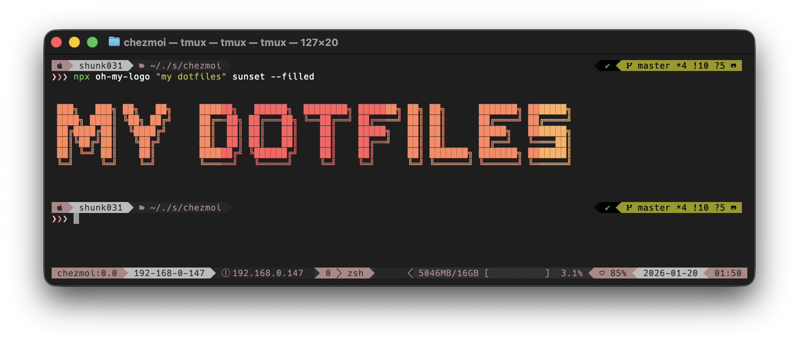
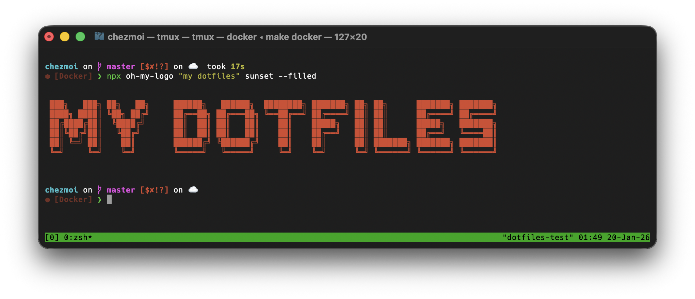

<div align="center">
    
    <h1>📂 dotfiles</h1>
</div>

<div align="center">

[](https://github.com/shunk031/dotfiles/actions/workflows/remote.yaml)
[](https://github.com/shunk031/dotfiles/actions/workflows/test.yaml)
[](https://codecov.io/gh/shunk031/dotfiles)
[![DeepWiki](https://img.shields.io/badge/DeepWiki-shunk031%2Fdotfiles-blue.svg?logo=data:image/png;base64,iVBORw0KGgoAAAANSUhEUgAAACwAAAAyCAYAAAAnWDnqAAAAAXNSR0IArs4c6QAAA05JREFUaEPtmUtyEzEQhtWTQyQLHNak2AB7ZnyXZMEjXMGeK/AIi+QuHrMnbChYY7MIh8g01fJoopFb0uhhEqqcbWTp06/uv1saEDv4O3n3dV60RfP947Mm9/SQc0ICFQgzfc4CYZoTPAswgSJCCUJUnAAoRHOAUOcATwbmVLWdGoH//PB8mnKqScAhsD0kYP3j/Yt5LPQe2KvcXmGvRHcDnpxfL2zOYJ1mFwrryWTz0advv1Ut4CJgf5uhDuDj5eUcAUoahrdY/56ebRWeraTjMt/00Sh3UDtjgHtQNHwcRGOC98BJEAEymycmYcWwOprTgcB6VZ5JK5TAJ+fXGLBm3FDAmn6oPPjR4rKCAoJCal2eAiQp2x0vxTPB3ALO2CRkwmDy5WohzBDwSEFKRwPbknEggCPB/imwrycgxX2NzoMCHhPkDwqYMr9tRcP5qNrMZHkVnOjRMWwLCcr8ohBVb1OMjxLwGCvjTikrsBOiA6fNyCrm8V1rP93iVPpwaE+gO0SsWmPiXB+jikdf6SizrT5qKasx5j8ABbHpFTx+vFXp9EnYQmLx02h1QTTrl6eDqxLnGjporxl3NL3agEvXdT0WmEost648sQOYAeJS9Q7bfUVoMGnjo4AZdUMQku50McDcMWcBPvr0SzbTAFDfvJqwLzgxwATnCgnp4wDl6Aa+Ax283gghmj+vj7feE2KBBRMW3FzOpLOADl0Isb5587h/U4gGvkt5v60Z1VLG8BhYjbzRwyQZemwAd6cCR5/XFWLYZRIMpX39AR0tjaGGiGzLVyhse5C9RKC6ai42ppWPKiBagOvaYk8lO7DajerabOZP46Lby5wKjw1HCRx7p9sVMOWGzb/vA1hwiWc6jm3MvQDTogQkiqIhJV0nBQBTU+3okKCFDy9WwferkHjtxib7t3xIUQtHxnIwtx4mpg26/HfwVNVDb4oI9RHmx5WGelRVlrtiw43zboCLaxv46AZeB3IlTkwouebTr1y2NjSpHz68WNFjHvupy3q8TFn3Hos2IAk4Ju5dCo8B3wP7VPr/FGaKiG+T+v+TQqIrOqMTL1VdWV1DdmcbO8KXBz6esmYWYKPwDL5b5FA1a0hwapHiom0r/cKaoqr+27/XcrS5UwSMbQAAAABJRU5ErkJggg==)](https://deepwiki.com/shunk031/dotfiles)

</div>

## 🗿 Overview

This [dotfiles](https://github.com/shunk031/dotfiles) repository is managed with [`chezmoi🏠`](https://www.chezmoi.io/), a great dotfiles manager.
The setup scripts are aimed for [MacOS](https://www.apple.com/jp/macos), [Ubuntu Desktop](https://ubuntu.com/desktop), and [Ubuntu Server](https://ubuntu.com/server). The first two (MacOS/Ubuntu Desktop) include settings for `client` machines and the latter one (Ubuntu Server) for `server` machines.

The actual dotfiles exist under the [`home`](https://github.com/shunk031/dotfiles/tree/main/home) directory specified in the [`.chezmoiroot`](https://github.com/shunk031/dotfiles/blob/main/.chezmoiroot).
See [.chezmoiroot - chezmoi](https://www.chezmoi.io/reference/special-files-and-directories/chezmoiroot/) more detail on the setting.

The following are the tools and coding assistants I mainly use in this setup.

### Shell and terminal tooling:

[](https://github.com/zsh-users/zsh)
[](https://github.com/tmux/tmux)
[](https://github.com/rossmacarthur/sheldon)
[](https://github.com/starship/starship)
[](https://github.com/jdx/mise)

### AI coding assistants:

[](https://github.com/anthropics/claude-code)
[](https://github.com/openai/codex)
[](https://github.com/google-antigravity/antigravity-cli)

## 📥 Setup

To set up the dotfiles run the appropriate snippet in the terminal.

<details>
<summary>About the hosted <code>setup.sh</code> snippet</summary>

The `curl` and `wget` snippets below download `setup.sh` from GitHub Pages.
To keep `http://shunk031.me/dotfiles/setup.sh` and `https://shunk031.me/dotfiles/setup.sh` working, `Settings > Pages` must publish from the branch that contains `setup.sh` and use `/(root)` as the source folder.
Selecting `/docs` would stop serving the repository-root `setup.sh`.
</details>

### 💻 `MacOS` [](https://github.com/shunk031/dotfiles/actions/workflows/macos.yaml)

- Configuration snippet of the Apple Silicon MacOS environment for client macnine:

```console
bash -c "$(curl -fsLS http://shunk031.me/dotfiles/setup.sh)"
```



### 🖥️ `Ubuntu` [](https://github.com/shunk031/dotfiles/actions/workflows/ubuntu.yaml)

- Configuration snippet of the Ubuntu environment for both client and server machine:

```console
bash -c "$(wget -qO - http://shunk031.me/dotfiles/setup.sh)"
```



### Minimal setup

The following is a minimal setup command to install chezmoi and my dotfiles from the github repository on a new empty machine:

> sh -c "$(curl -fsLS get.chezmoi.io)" -- init shunk031 --apply

## ⚙️ Install & Setup Application Individually

This repository provides for the installation and setup of each application individually.
The desired application can be installed as follows (e.g., docker installation on MacOS):

```shell
bash install/macos/common/docker.sh
```

Each installation script can be found under the [`./install`](https://github.com/shunk031/dotfiles/tree/main/install) directory.

## 🛠️ Update & Test 🧪

Updating and testing the dotfiles follows [chezmoi's daily operations](https://www.chezmoi.io/user-guide/daily-operations/).
To verify that the updated scripts work correctly, run the scripts on the actual local machine and on the docker container.

### 💡 Develop the Setup Scripts

The setup scripts are stored as shellscripts in an appropriate location under the [`./install`](https://github.com/shunk031/dotfiles/tree/main/install) directory.
After verifying that the shellscript works, store the [chezmoi template](https://www.chezmoi.io/user-guide/templating/)-based file, which is based on the shellscript, in an appropriate location under the [`./home/.chezmoiscripts`](https://github.com/shunk031/dotfiles/tree/main/home/.chezmoiscripts) directory.

Below is the correspondence between shellscript and template for docker installation on MacOS.

- The shellscript for docker: [`install/macos/common/docker.sh`](https://github.com/shunk031/dotfiles/blob/main/install/macos/common/docker.sh)
- The chezmoi template for docker: [`home/.chezmoiscripts/macos/run_once_10-install-docker.sh.tmpl`](https://github.com/shunk031/dotfiles/blob/main/home/.chezmoiscripts/macos/run_once_10-install-docker.sh.tmpl)

### 💾 Test on the Local Machine

Currently, chezmoi does not automatically reflect updated configuration files (ref. [twpayne/chezmoi#2738](https://github.com/twpayne/chezmoi/discussions/2738)).
The following command will execute the [`chezmoi apply`](https://www.chezmoi.io/reference/commands/apply/) command as soon as the file is modified using [`watchexec`](https://github.com/watchexec/watchexec).

```shell
make watch
```

The chezmoi documentation mentions automatica application by [`watchman`](https://facebook.github.io/watchman/).
See [https://www.chezmoi.io/user-guide/advanced/use-chezmoi-with-watchman/](https://www.chezmoi.io/user-guide/advanced/use-chezmoi-with-watchman/) for more detail.

### 🐳 Test on Docker Container

Test the executation of the setup scripts on Ubuntu in its initial state.
The following command will launch the test environment using Docker 🐳.

```shell
make docker

# docker run -it -v "$(pwd):/home/$(whoami)/.local/share/chezmoi" dotfiles /bin/bash --login
# shunk031@5f93d270cb51:~$
```

Run the [`chezmoi init --apply`](https://www.chezmoi.io/user-guide/setup/#use-a-hosted-repo-to-manage-your-dotfiles-across-multiple-machines) command to verify that the system is set up correctly.

```shell
shunk031@5f93d270cb51:~$ chezmoi init --apply
```

### 🦇 Unit Test with [Bats](https://github.com/bats-core/bats-core) [](https://github.com/shunk031/dotfiles/actions/workflows/test.yaml)

Test the shellscript for setup with [Bash Automated Testing System (bats)](https://github.com/bats-core/bats-core).
The scripts for the unit test can be found under [`./tests`](https://github.com/shunk031/dotfiles/tree/main/tests/install) directory.

### 📦 Continuously monitor code coverage with Codecov [](https://codecov.io/gh/shunk031/dotfiles)

The code coverage of the [`./install`](https://github.com/shunk031/dotfiles/tree/main/install) scripts are continuously monitored at [app.codecov.io/gh/shunk031/dotfiles](https://app.codecov.io/gh/shunk031/dotfiles). The following Icicle graph represents the code coverage of the scripts:

[](https://app.codecov.io/gh/shunk031/dotfiles)

## 📊 Measure the startup speed of the dotfiles

The startup speed of zsh on MacOS with this dotfile is continuously measured at [shunk031.me/my-dotfiles-benchmarks](https://shunk031.me/my-dotfiles-benchmarks/) using [benchmark-action/github-action-benchmark](https://github.com/benchmark-action/github-action-benchmark).

## 💡 Miscellaneous Tips

### Minimum setup for server machine without chezmoi

- Download [`.tmux.conf.d/system/server.conf`](https://github.com/shunk031/dotfiles/blob/main/home/dot_tmux.conf.d/system/server.conf) and deploy as `~/.tmux.conf`

```shell
wget -O ~/.tmux.conf https://raw.githubusercontent.com/shunk031/dotfiles/main/home/dot_tmux.conf.d/system/server.conf
```

- Download [`.vimrc`](https://github.com/shunk031/dotfiles/blob/main/home/dot_vimrc) and deploy to `~/.vimrc`

```shell
wget -O ~/.vimrc https://raw.githubusercontent.com/shunk031/dotfiles/main/home/dot_vimrc
```

## 📈 Stats


## 👏 Acknowledgements

Inspiration and code was taken from many sources, including:

- [twpayne/chezmoi](https://github.com/twpayne/chezmoi) from [twpayne](https://github.com/twpayne).
- [alrra/dotfiles](https://github.com/alrra/dotfiles): macOS / Ubuntu dotfiles from [@alrra](https://github.com/alrra).
- [b4b4r07/dotfiles](https://github.com/b4b4r07/dotfiles): A repository that gathered files starting with dot from [@b4b4r07](https://github.com/b4b4r07).
- [da-edra/dotfiles](https://github.com/da-edra/dotfiles): Arch Linux config from [@da-edra](https://github.com/da-edra).

## 📝 License

The code is available under the [MIT license](https://github.com/shunk031/dotfiles/blob/main/LICENSE).
