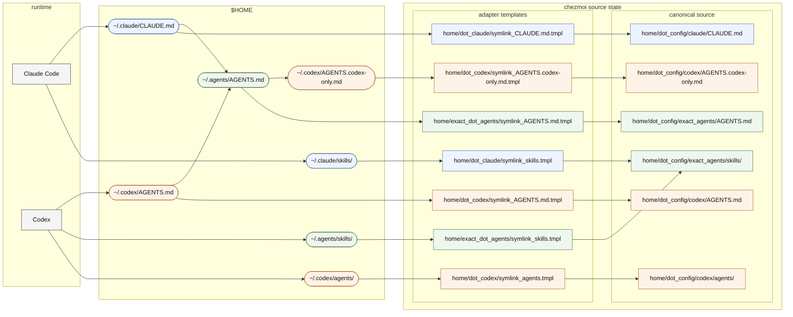

- This directory is the canonical source for `~/.agents`.
- [AGENTS.md](AGENTS.md) is the shared guidance used directly by `~/.agents/AGENTS.md`, imported from `~/.claude/CLAUDE.md` with `@~/.agents/AGENTS.md`, and read first from `~/.codex/AGENTS.md` before `~/.codex/AGENTS.codex-only.md`.
- [home/exact_dot_agents/](../../exact_dot_agents/) is only the adapter layer that exposes this source in the applied home layout.
- The design keeps edits in one git-friendly place while preserving the familiar home path.
- Edit files here; the adapter keeps the home path stable.

## Layout Overview

