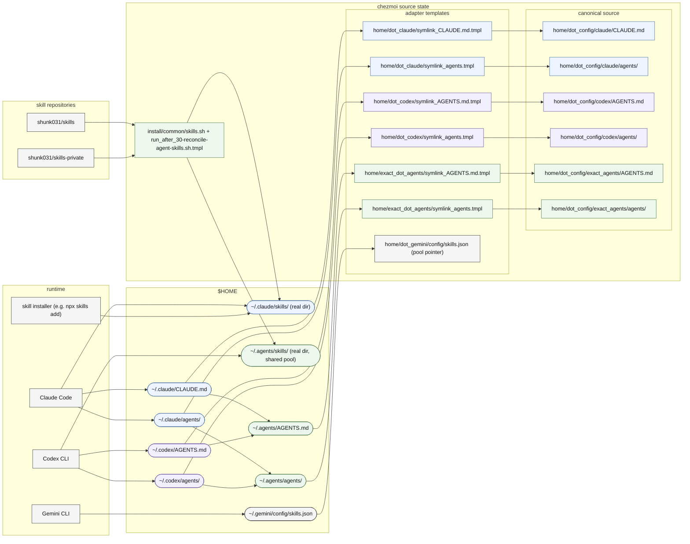

In this repo, this directory is the editable shared source for agent guidance that is exposed as `~/.agents` through adapter templates. The `exact_` segment in this path is a chezmoi source-state attribute, not a generic "canonical source" naming convention. See the official chezmoi reference for [Source state attributes](https://www.chezmoi.io/reference/source-state-attributes/).

In chezmoi, `dot_` changes a target name to start with `.`, while `exact_` removes entries in the target directory that are not explicitly managed in the source state. This repo does not apply `.config/agents` directly: [home/.chezmoitemplates/chezmoiignore.d/common](../../.chezmoitemplates/chezmoiignore.d/common) ignores that target, while [home/exact_dot_agents/](../../exact_dot_agents/) provides the home-facing `~/.agents` adapter.

[AGENTS.md](AGENTS.md) is the shared guidance used directly by `~/.agents/AGENTS.md`, imported from `~/.claude/CLAUDE.md` with `@~/.agents/AGENTS.md`, and referenced from `~/.codex/AGENTS.md`. Shared long-form agent instructions live in [agents/](agents/) and are exposed as `~/.agents/agents`; Claude and Codex wrappers explicitly tell each tool to read the same shared Markdown first. Edit files here; the adapter keeps the home path stable.

## Skill Pool and Subscription Policy

`~/.agents/skills` is a real directory: the shared skills pool. This repository no longer carries skill content. Skills live in [shunk031/skills](https://github.com/shunk031/skills) (public) and `shunk031/skills-private` (private), and these dotfiles subscribe to them.

[install/common/skills.sh](../../../install/common/skills.sh) declares the subscription as a flat `SKILLS_ALLOWLIST` of `<owner>/<repo>[#<ref>]:<skill>` entries. [home/.chezmoiscripts/common/run_after_30-reconcile-agent-skills.sh.tmpl](../../.chezmoiscripts/common/run_after_30-reconcile-agent-skills.sh.tmpl) reconciles the pool against that list on every `chezmoi apply`, using the pinned `skills` CLI: it installs what is missing, updates on a daily throttle, and prunes only what a previous run recorded in its manifest. Adding or removing a skill from this machine means editing one line of the allowlist.

`.agents/skills` is listed in [home/.chezmoitemplates/chezmoiignore.d/common](../../.chezmoitemplates/chezmoiignore.d/common). That entry is load-bearing: without it chezmoi would treat the pool as its own and overwrite the directories the `skills` CLI installs.

Gemini reads the same pool through a single pointer, [home/dot_gemini/config/skills.json](../../dot_gemini/config/skills.json), rather than one symlink per skill.

`~/.claude/skills` is also a real directory, and it is Claude-only. The `skills` CLI links each pool entry it installs into `~/.claude/skills`, and installers may write real skill directories there directly. The reconcile script separately links pool entries that no CLI install created, such as the generated `herdr` entry, and never replaces a real installer-written entry with a link.

To change a skill's content, edit it in the repository that owns it; the `shunk031-manage-public-private-skills` skill decides which of the two that is.

The diagram below describes this repository's source-of-truth layout, not the meaning of chezmoi's `exact_` attribute itself.

## Layout Overview

```mermaid
flowchart LR
  subgraph RUNTIME["runtime"]
    U_CLAUDE["Claude Code"]
    U_CODEX["Codex CLI"]
    U_INSTALLER["skill installer (e.g. npx skills add)"]
    U_GEMINI["Gemini CLI"]
  end

  subgraph UPSTREAM["skill repositories"]
    R_PUBLIC["shunk031/skills"]
    R_PRIVATE["shunk031/skills-private"]
  end

  subgraph HOME["$HOME"]
    H_CLAUDE(["~/.claude/CLAUDE.md"])
    H_CLAUDE_AGENTS(["~/.claude/agents/"])
    H_CLAUDE_SKILLS(["~/.claude/skills/ (real dir)"])

    H_CODEX(["~/.codex/AGENTS.md"])
    H_CODEX_AGENTS(["~/.codex/agents/"])

    H_SHARED(["~/.agents/AGENTS.md"])
    H_SHARED_AGENTS(["~/.agents/agents/"])
    H_SHARED_SKILLS(["~/.agents/skills/ (real dir, shared pool)"])

    H_GEMINI_SKILLS(["~/.gemini/config/skills.json"])
  end

  subgraph CHEZMOI["chezmoi source state"]
    direction LR

    subgraph ADAPTER["adapter templates"]
      A_CLAUDE["home/dot_claude/symlink_CLAUDE.md.tmpl"]
      A_CLAUDE_AGENTS["home/dot_claude/symlink_agents.tmpl"]

      A_CODEX["home/dot_codex/symlink_AGENTS.md.tmpl"]
      A_CODEX_AGENTS["home/dot_codex/symlink_agents.tmpl"]

      A_SHARED["home/exact_dot_agents/symlink_AGENTS.md.tmpl"]
      A_SHARED_AGENTS["home/exact_dot_agents/symlink_agents.tmpl"]
      A_GEMINI_SKILLS["home/dot_gemini/config/skills.json (pool pointer)"]
    end

    subgraph CANONICAL["canonical source"]
      S_CLAUDE["home/dot_config/claude/CLAUDE.md"]
      S_CLAUDE_AGENTS["home/dot_config/claude/agents/"]

      S_CODEX["home/dot_config/codex/AGENTS.md"]
      S_CODEX_AGENTS["home/dot_config/codex/agents/"]

      S_SHARED["home/dot_config/exact_agents/AGENTS.md"]
      S_SHARED_AGENTS["home/dot_config/exact_agents/agents/"]
    end

    RECONCILE["install/common/skills.sh + run_after_30-reconcile-agent-skills.sh.tmpl"]
  end

  U_CLAUDE --> H_CLAUDE
  U_CLAUDE --> H_CLAUDE_AGENTS
  U_CLAUDE --> H_CLAUDE_SKILLS
  U_CODEX --> H_CODEX
  U_CODEX --> H_CODEX_AGENTS
  U_CODEX --> H_SHARED_SKILLS
  U_INSTALLER --> H_CLAUDE_SKILLS
  U_GEMINI --> H_GEMINI_SKILLS
  H_CLAUDE --> H_SHARED
  H_CLAUDE_AGENTS --> H_SHARED_AGENTS
  H_CODEX --> H_SHARED
  H_CODEX_AGENTS --> H_SHARED_AGENTS

  H_CLAUDE --> A_CLAUDE --> S_CLAUDE
  H_CLAUDE_AGENTS --> A_CLAUDE_AGENTS --> S_CLAUDE_AGENTS

  H_CODEX --> A_CODEX --> S_CODEX
  H_CODEX_AGENTS --> A_CODEX_AGENTS --> S_CODEX_AGENTS

  H_SHARED --> A_SHARED --> S_SHARED
  H_SHARED_AGENTS --> A_SHARED_AGENTS --> S_SHARED_AGENTS
  R_PUBLIC --> RECONCILE
  R_PRIVATE --> RECONCILE
  RECONCILE --> H_SHARED_SKILLS
  RECONCILE --> H_CLAUDE_SKILLS
  H_GEMINI_SKILLS --> A_GEMINI_SKILLS

  classDef runtime fill:#f5f5f5,stroke:#444,color:#111;
  classDef agents fill:#eef7ee,stroke:#4f7a4f,color:#111;
  classDef claude fill:#eef4ff,stroke:#4a6fa5,color:#111;
  classDef codex fill:#f2f0ff,stroke:#6750a4,color:#111;

  class U_CLAUDE,U_CODEX,U_INSTALLER,U_GEMINI,R_PUBLIC,R_PRIVATE runtime;
  class H_SHARED,H_SHARED_AGENTS,H_SHARED_SKILLS,A_SHARED,A_SHARED_AGENTS,S_SHARED,S_SHARED_AGENTS,RECONCILE agents;
  class H_CLAUDE,H_CLAUDE_AGENTS,H_CLAUDE_SKILLS,A_CLAUDE,A_CLAUDE_AGENTS,S_CLAUDE,S_CLAUDE_AGENTS claude;
  class H_CODEX,H_CODEX_AGENTS,A_CODEX,A_CODEX_AGENTS,S_CODEX,S_CODEX_AGENTS codex;
  class H_GEMINI_SKILLS,A_GEMINI_SKILLS runtime;
```
